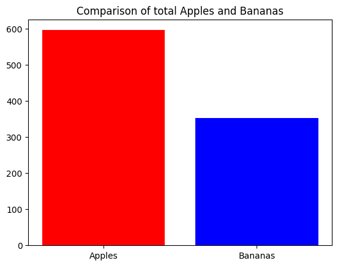

# Jupyter notebook sample


```python
# Import libraries
import pandas as pd
import matplotlib.pyplot as plt
```

### Interactive tables

Effortlessly view, navigate, sort, and filter data. Create charts and access essential data insights, including descriptive statistics and missing values – all without writing a single line of code.


```python
# Defining data for the dataframe
data = {
    'Basket': ['A', 'B', 'C', 'D', 'E', 'F', 'G', 'H', 'I', 'J', 'K', 'L', 'M', 'N', 'O', 'P'],
    'Apples': [10, 20, 30, 56, 40, 40, 67, 47, 40, 4, 49, 52, 5, 56, 35, 45],
    'Bananas': [15, 6, 3, 45, 67, 44, 45, 11, 14, 18, 13, 12, 1, 34, 12, 12]
}

# Creating the dataframe
df = pd.DataFrame(data)

df
```


<div>
<style scoped>
    .dataframe tbody tr th:only-of-type {
        vertical-align: middle;
    }

    .dataframe tbody tr th {
        vertical-align: top;
    }

    .dataframe thead th {
        text-align: right;
    }
</style>
<table border="1" class="dataframe">
  <thead>
    <tr style="text-align: right;">
      <th></th>
      <th>Basket</th>
      <th>Apples</th>
      <th>Bananas</th>
    </tr>
  </thead>
  <tbody>
    <tr>
      <th>0</th>
      <td>A</td>
      <td>10</td>
      <td>15</td>
    </tr>
    <tr>
      <th>1</th>
      <td>B</td>
      <td>20</td>
      <td>6</td>
    </tr>
    <tr>
      <th>2</th>
      <td>C</td>
      <td>30</td>
      <td>3</td>
    </tr>
    <tr>
      <th>3</th>
      <td>D</td>
      <td>56</td>
      <td>45</td>
    </tr>
    <tr>
      <th>4</th>
      <td>E</td>
      <td>40</td>
      <td>67</td>
    </tr>
    <tr>
      <th>5</th>
      <td>F</td>
      <td>40</td>
      <td>44</td>
    </tr>
    <tr>
      <th>6</th>
      <td>G</td>
      <td>67</td>
      <td>45</td>
    </tr>
    <tr>
      <th>7</th>
      <td>H</td>
      <td>47</td>
      <td>11</td>
    </tr>
    <tr>
      <th>8</th>
      <td>I</td>
      <td>40</td>
      <td>14</td>
    </tr>
    <tr>
      <th>9</th>
      <td>J</td>
      <td>4</td>
      <td>18</td>
    </tr>
    <tr>
      <th>10</th>
      <td>K</td>
      <td>49</td>
      <td>13</td>
    </tr>
    <tr>
      <th>11</th>
      <td>L</td>
      <td>52</td>
      <td>12</td>
    </tr>
    <tr>
      <th>12</th>
      <td>M</td>
      <td>5</td>
      <td>1</td>
    </tr>
    <tr>
      <th>13</th>
      <td>N</td>
      <td>56</td>
      <td>34</td>
    </tr>
    <tr>
      <th>14</th>
      <td>O</td>
      <td>35</td>
      <td>12</td>
    </tr>
    <tr>
      <th>15</th>
      <td>P</td>
      <td>45</td>
      <td>12</td>
    </tr>
  </tbody>
</table>
</div>


### Visualization in IDE

Create graphs and visualizations that match your chosen color scheme.


```python
# Calculate the sums
sum_apples = df['Apples'].sum()
sum_bananas = df['Bananas'].sum()

# Create a bar chart
plt.bar(['Apples', 'Bananas'], [sum_apples, sum_bananas], color=['red', 'blue'])

# Set a title
plt.title('Comparison of total Apples and Bananas')

# Show the plot
plt.show()
```


    

    


```python

```
